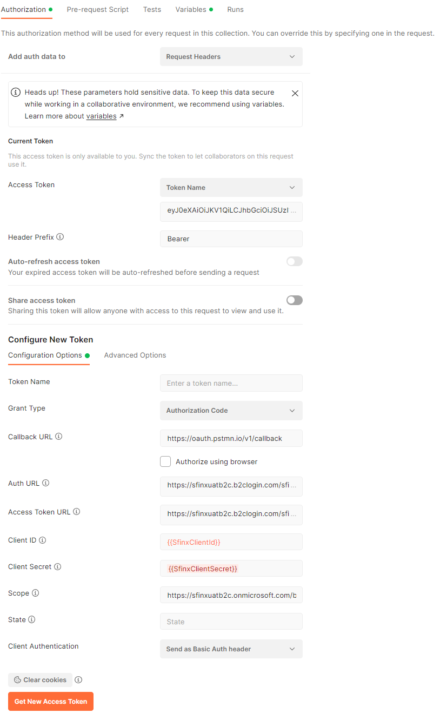

# Sfinx documentation

## Backend API

> **Warning**
> The current release of the API is just mocked up and is subject to many changes to come.  

Important links

- [Open API spec](https://weu-sfinx-dev-apim.azure-api.net/backend/api/v1/openapi.yaml)

### Authentication

In order to call the API in Azure API Management, a user has to pass a valid JWT token, obtained from our Active Directory B2C. There we currently have the user-name / password authentication enabled, but in the future we can open for other identity providers , such as Twitter, Facebook, but also custom OpenId providers, such as itsme.
This section explains how to obtain such a token, with the different client tools.

### Obtain a valid JWT token by using Postman

To use the API, you have to request a client secret to your contact person at Sfinx.  You will need this, to gain access to the API.  Currently we only provide access to our dev environment, which hosts a mocked up version of the API.

**Parameters for dev environment**

| Field                   | Description                                     | Dev                                                                                                        |
|-------------------------|-------------------------------------------------|------------------------------------------------------------------------------------------------------------|
| Auth URL                | The Authorization URL for the actual user flow  | `https://sfinxdevb2c.b2clogin.com/sfinxdevb2c.onmicrosoft.com/B2C_1_signup_sfinx_user/oauth2/v2.0/authorize` |
| Access Token URL        | The URL of AD B2C where tokens will be provided | `https://sfinxdevb2c.b2clogin.com/sfinxdevb2c.onmicrosoft.com/B2C_1_signup_sfinx_user/oauth2/v2.0/token`     |
| Client ID               | A client specific generated id       |                                                                         |
| Client Secret           | A client specific generated secret                |                                                                                                            |
| Scope                   | The requested access and operations to the API  | `https://sfinxdevb2c.onmicrosoft.com/backend-api/Lock.OpenClose`                                             |
| Authorize using browser | Yes                                             |                                                                                                            |

