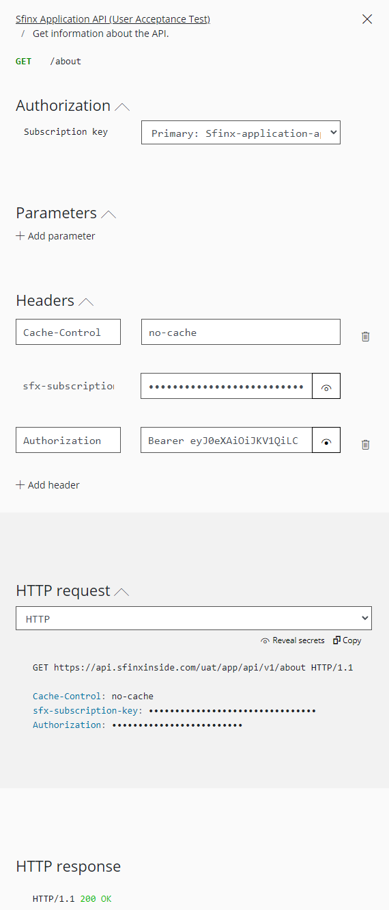

# Make an API call from the Sfinx developer portal

Below you can find how the about endpoint of the Application API product on the user acceptance test environment is called through the Sfinx developer portal. The same approach is valid for other Sfinx API products or endpoints:

* Ensure you are signed in to the developer portal and a subscription for the desired Sfinx product is active.
* Select product Sfinx Application API (uat).
* Group the operations by tag.
* Select the GET operation in the about section.
* Click Try it
* Add an Authorization header with the bearer access token. Click [here](./postman-request-access-token.md) for more information on how to obtain an access token.
* Click send

The request should complete with a 200 OK.

