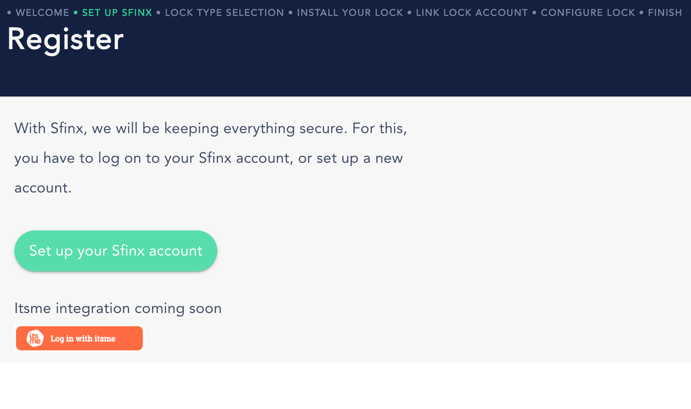

# Customer onboarding wizard

When customers get invited by an organization, they will follow the step-by-step wizard in order to install and configure their lock and link it to the organization by whom they were invited.

## Invitation code validation

- When the url is correct, the invitation code will automatically be pre-filled. 
- The user should click the `Validate Code` button and if all goes well, a message should be visible that the code is valid.
- The next step is to set up the smart lock, by clicking the button.

## Sign in to Sfinx

On this page, the user should sign on (or sign in) to the Sfinx account, as described in [this article](./registration.md).

## Select or set up your lock

On this page, you can select an existing lock to be linked to the organization (and the reference).  
If you don't have a lock registered, you can also register a new lock by following the right steps in the wizard.

## Complete registration

In the last step, the lock can be selected and the external reference that was linked to the invitation code is filled in (and is read-only).  It's possible to add a Free Text to the lock, and after checking the permissions, the lock can be registered.