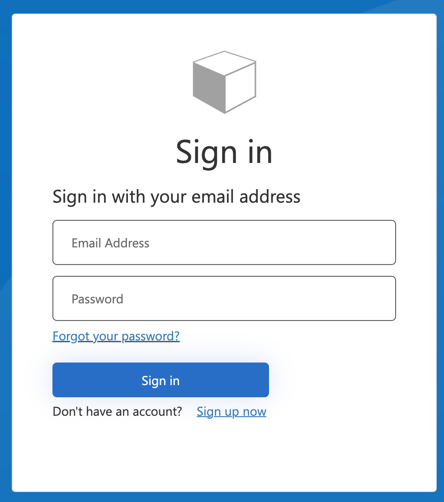
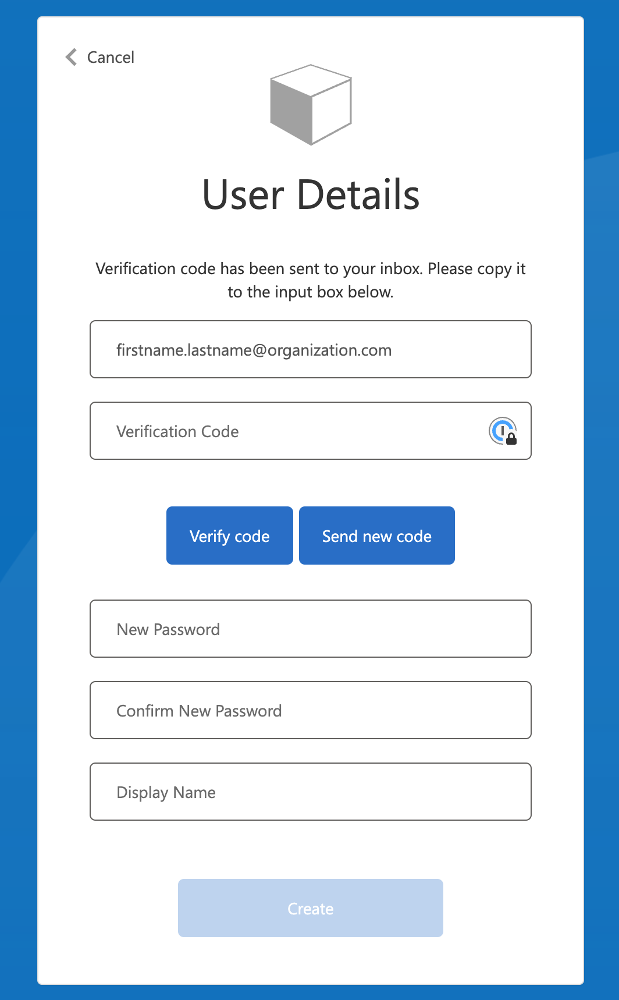

# Portal login

To register on the portal, navigate to the [Sfinx portal](https://portal-uat.sfinxinside.com/) (UAT)
On the top right corner, click `Sign in / Sign Up` (can be localized to your language).

This will point you to a Microsoft log on page (we are leveraging the secure Azure B2C Active Directory service for this):

You can sign in with your existing credentials, or click `Sign up now`, to register a new account on the Sfinx platform.  This will bring you to the sign up experience: 

. 

After providing your e-mail address , you'll get a verification code, so to prove the e-mail address belongs to you.  After providing all the right information, click `Create` and you can use the log in experience to log in to the portal. 
